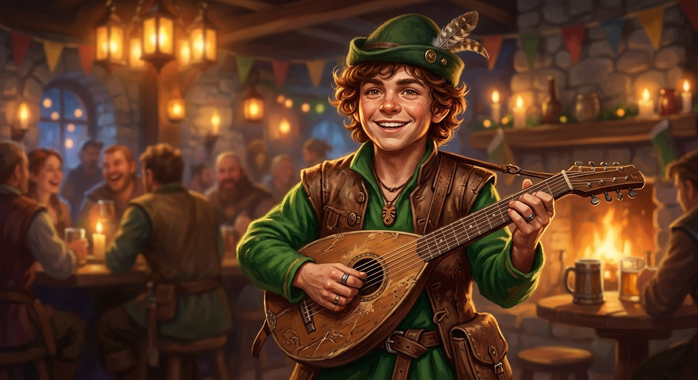

# Milo Swiftfoot

## Basic Information
- **Race:** Lightfoot Halfling
- **Class:** Bard (College of Lore) - Level 3
- **Background:** Entertainer
- **Alignment:** Chaotic Good
- **Deity:** Milil (The Lord of Song)

## Ability Scores
- **Strength:** 8 (-1)
- **Dexterity:** 14 (+2)
- **Constitution:** 12 (+1)
- **Intelligence:** 10 (+0)
- **Wisdom:** 10 (+0)
- **Charisma:** 16 (+3)

## Combat Statistics
- **Armor Class (AC):** 13 (Leather Armor + Dex)
- **Hit Points (HP):** 21
- **Speed:** 25 ft
- **Proficiency Bonus:** +2
- **Passive Perception:** 12

## Proficiencies & Languages
- **Armor:** Light armor
- **Weapons:** Simple weapons, hand crossbows, longswords, rapiers, shortswords
- **Tools:** Lute, Disguise kit
- **Saving Throws:** Dexterity, Charisma
- **Skills:** Performance (Expertise), Persuasion (Expertise), Acrobatics, Sleight of Hand, Perception, Deception
- **Languages:** Common, Halfling

## Features & Traits
- **Halfling Luck:** Reroll a natural 1 on attack rolls, ability checks, or saving throws.
- **Brave:** Advantage on saving throws against being frightened.
- **Naturally Stealthy:** Can attempt to hide even when obscured only by a creature larger than you.
- **Bardic Inspiration (d6):** Bonus action to grant an ally a d6 to add to one attack roll, ability check, or saving throw.
- **Jack of All Trades:** Add half your proficiency bonus to all ability checks you are not already proficient in.
- **Song of Rest (d6):** Allies regain +1d6 extra hit points when they spend a Hit Die during a short rest.
- **Expertise:** Double proficiency bonus on Performance and Persuasion.
- **College of Lore:** Bonus proficiency in three skills; Cutting Words lets you expend a Bardic Inspiration die to subtract from an enemy's attack roll, damage roll, or ability check.
- **Spellcasting:** Cantrips (*Vicious Mockery*, *Mage Hand*, *Light*); Level 1 Spells (*Faerie Fire*, *Healing Word*, *Dissonant Whispers*, *Tasha's Hideous Laughter*); Level 2 Spells (*Shatter*, *Heat Metal*, *Invisibility*).

## Equipment
- Rapier, Shortbow with quiver of 20 arrows
- Leather Armor, Dagger
- Lute (gift from a traveling elven minstrel)
- Entertainer's Pack, Costume, Disguise Kit
- Belt Pouch, 12 gold pieces

