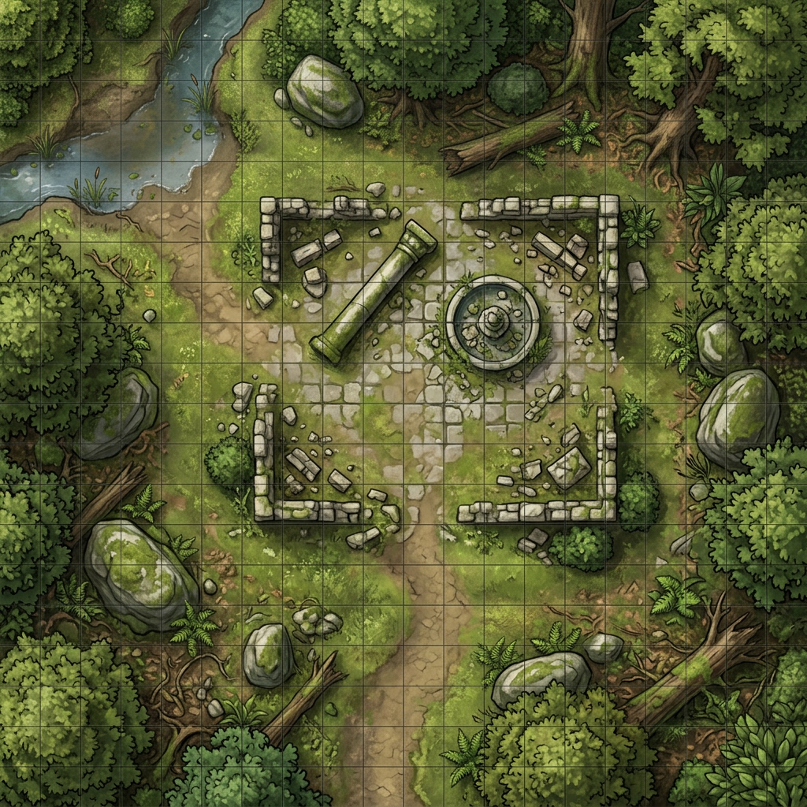

# Maps

Top-down battlemaps for tabletop play with the party in [`characters/`](../characters/).

## Forest Ruin Clearing

| | |
| --- | --- |
| **File** | [`forest-ruin-clearing.png`](./forest-ruin-clearing.png) |
| **View** | Top-down (orthographic) |
| **Scale** | 1 square = 5 feet |
| **Suggested size** | ~20 × 20 squares (100 × 100 ft) |
| **Theme** | Overgrown woodland ruin |

### Terrain

- **Dirt path** — open ground from the south into the ruined courtyard.
- **Broken stone walls** — low cover. Corners still stand; the courtyard is open on all four sides.
- **Fallen pillar** — difficult terrain / half cover.
- **Dry fountain** — difficult terrain; a natural rally point in the center.
- **Stream (northwest)** — shallow water. Treat as difficult terrain unless a creature has a swim speed.
- **Trees, boulders, and fallen logs** — heavy cover around the edges. Dense canopy along the map border is not walkable without climbing or squeezing.

### Encounter hooks

A simple roadside ambush, a shrine the party must reclaim, or a rest site that is not as abandoned as it looks. Fits Eldrin's ruin-cleansing work, Lyra's stealth approaches through the trees, Thorin's stone-reading, Zephyr's open-sky stormcasting, and Milo's "we should definitely camp here" optimism.
